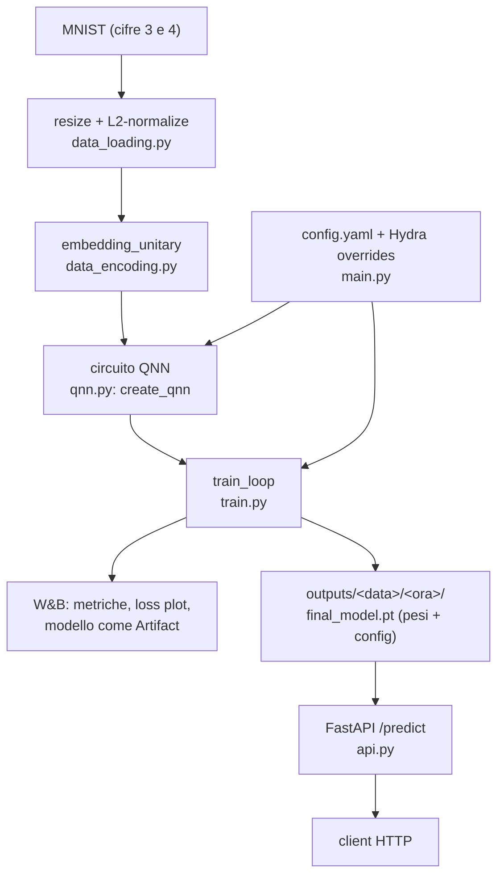

# EQNN — Equivariant Quantum Neural Network

[](https://github.com/giuseppedambruoso/eqnn/actions/workflows/ci.yml)
[](LICENSE)
[](pyproject.toml)

Progetto di ricerca su reti neurali quantistiche (QNN) equivarianti, addestrate su MNIST tramite circuiti parametrici (PennyLane) e tracciate su [Weights & Biases](https://wandb.ai).

Ogni sezione qui sotto è spiegata in due modi:
- 🔰 **Se non hai esperienza di programmazione** — segui questi passi alla lettera, copiando i comandi così come sono.
- 👩‍💻 **Se sei uno sviluppatore** — versione sintetica con i dettagli tecnici.

## Architettura



---

## 1. Installazione

### 🔰 Guida per chi parte da zero

1. Installa **Docker Desktop** (include tutto il necessario): vai su https://www.docker.com/products/docker-desktop/, scaricalo e installalo, poi aprilo (deve rimanere in esecuzione in background — vedrai un'icona nella barra delle applicazioni).
2. Apri un terminale (su Windows: "WSL"/"Ubuntu" dal menu Start; su Mac: l'app "Terminale").
3. Scarica il progetto sul tuo computer:
   ```bash
   git clone git@github.com:giuseppedambruoso/eqnn.git
   cd eqnn
   ```
4. Crea il file delle impostazioni segrete a partire dal modello fornito:
   ```bash
   cp .env.example .env
   ```
5. Apri il file `.env` con un editor di testo semplice (es. `nano .env` nel terminale) e incolla la tua **API key di Weights & Biases**, che serve per vedere i grafici dei risultati in un sito web dedicato. La ottieni gratuitamente registrandoti su https://wandb.ai e copiandola da https://wandb.ai/authorize. Il file deve assomigliare a:
   ```
   WANDB_API_KEY=la-tua-chiave-qui
   WANDB_MODE=online
   WANDB_PROJECT=eqnn
   ```
   Salva e chiudi (`Ctrl+O`, invio, poi `Ctrl+X` in `nano`).
6. Costruisci l'ambiente software (la prima volta richiede qualche minuto, scarica tutto il necessario in automatico):
   ```bash
   docker compose build
   ```

Fatto: il software è pronto, non devi installare Python, PyTorch o altro a mano — è tutto già dentro l'immagine Docker.

### 👩‍💻 Versione sviluppatori

Due percorsi possibili:

**A. Container (consigliato, riproducibile):**
```bash
git clone git@github.com:giuseppedambruoso/eqnn.git && cd eqnn
cp .env.example .env   # imposta WANDB_API_KEY
docker compose build
```
Immagine multi-stage ([Dockerfile](Dockerfile)): stage `builder` con Poetry + toolchain di compilazione, stage `runtime` slim, utente non-root, dipendenze pinnate via `poetry.lock` (committato per build riproducibili).

**B. Ambiente locale con Poetry:**
```bash
poetry install
poetry shell
```
Richiede Python `>=3.11,<3.13` (vedi `pyproject.toml`). Per installare un pacchetto nuovo aggiornando il lock file: `poetry add <package>`; per installarlo solo nel venv senza toccare `pyproject.toml`: `pip install <package>` dentro `poetry shell`.

---

## 2. Eseguire un run di training

### 🔰 Guida per chi parte da zero

Nel terminale, dentro la cartella `eqnn`, esegui:
```bash
./run_interactive.sh
```
Lo script ti farà alcune domande in italiano, una alla volta. Per ognuna:
- se premi solo **invio**, viene usato il valore tra parentesi quadre (il default, va bene nella maggior parte dei casi),
- altrimenti scrivi il valore che vuoi e premi invio.

Le domande principali:
- **Architettura**: quale dei 5 modelli quantistici usare — lo script te li elenca prima di chiedere (`config1`..`config5`). Se non sai quale scegliere, lascia il default (`config1`).
- **Numero immagini training (N)**: quante immagini usare per l'addestramento — un numero più basso (es. 20) fa un test veloce, un numero più alto (es. 300) allena meglio ma richiede più tempo.
- **Epoche**: quante volte il modello "ripassa" tutti i dati — più epoche possono migliorare il risultato ma allungano il tempo di attesa.
- **Seed**: un numero a caso per rendere l'esperimento ripetibile — lascialo pure com'è.

Alla fine ti verrà mostrato il comando che sta per essere eseguito e ti chiederà conferma (`Confermi? [Y/n]`): premi invio per procedere.

**Confrontare più configurazioni insieme**: scrivi una lista di valori separati da virgola *senza spazi* in una qualunque domanda (es. `config1,config2,config3,config4,config5` per l'architettura) — lo script se ne accorge da solo e ti chiede quanti job far girare in parallelo (K), dopo averti detto quanti core ha il tuo computer e quale valore di K è ragionevole non superare per non rallentare tutto il resto. Se le combinazioni sono più di K, le prime K partono subito e le altre si mettono in coda automaticamente, partendo una alla volta man mano che si libera un posto.

### 👩‍💻 Versione sviluppatori

Il progetto usa [Hydra](https://hydra.cc/) per la configurazione ([src/config/config.yaml](src/config/config.yaml)). `run_interactive.sh` è solo un wrapper che costruisce ed esegue `docker compose run` con gli override; puoi bypassarlo e scrivere gli override direttamente:

```bash
# run singolo
docker compose run --rm eqnn QNN.architecture=config3 DATA.N=200 TRAINING.epochs=50

# sweep/grid (multirun Hydra, un run per combinazione)
docker compose run --rm eqnn -m QNN.architecture=config1,config2,config3,config4,config5

# raggruppare i run di uno sweep su wandb, in parallelo su 4 core
docker compose run --rm -e WANDB_RUN_GROUP=arch-comparison eqnn -m QNN.architecture=config1,config2,config3,config4,config5 hydra/launcher=joblib hydra.launcher.n_jobs=4
```

Parametri configurabili: `GENERAL.{seed,dev}`, `DATA.{N,dataset,img_size,augment_test}`, `QNN.{num_qubits,p_err,reps,architecture,device}`, `TRAINING.{epochs,learning_rate,patience,min_delta}` — vedi [src/config/config.yaml](src/config/config.yaml) per i default.

`QNN.architecture` seleziona una delle 9 architetture supportate ([src/qnn.py:ARCHITECTURES](src/qnn.py)):

| Architettura | Rotazione | Entangler | Twirling | Equivariante |
|---|---|---|---|---|
| `config1` | RY | CNOT | No | No |
| `config2` | RY | CNOT | Sì | Sì |
| `config3` | RX | RXY (parametro fisso π/2, non allenabile) | No | No |
| `config4` | RX | RXY (parametro fisso π/2, non allenabile) | Sì | Sì |
| `config5` | RX | RYY/RYYYY (parametro fisso π/2, non allenabile) | Sì | Sì |
| `config6` | paper6 — blocchi D4 a generatori commutanti (6 parametri totali) | — | No (equivarianza esatta "by design") | Sì |
| `config7` | paper6, assi della colonna scompaginati (X→Y→Z→X) | — | No | No |
| `config8` | shared18 — stessi blocchi di config6/7 ma più ricchi (18 parametri totali) | — | No | Sì |
| `config9` | shared18, assi della colonna scompaginati | — | No | No |

**Nota su config3/config4**: con un entangler CNOT (o qualunque gate costruito solo da I/X, es. RXX), le rotazioni RX avrebbero gradiente *esattamente* zero — CNOT propaga operatori di tipo X solo in altri operatori di tipo X, e RX(θ) è a sua volta una combinazione di I e X, quindi commutano sempre e il valore misurato risulta costante in θ (verificato numericamente: stesso output al variare di θ da −2 a 3 radianti). L'entangler RXY rompe questa invarianza per quasi tutti i qubit, tranne il primo della catena (indice 0), che gioca sempre il ruolo "X" nella convenzione usata e resta quindi con parametro fisso — testato esplicitamente in `tests/test_training.py`.

**config6-config9** implementano lo schema a 5 blocchi (4 "fini" + 1 "grossolano") di [src/paper_ansatzes.py](src/paper_ansatzes.py): i 4 blocchi fini condividono lo STESSO set di parametri allenabili (parametri "legati"/tied — vedi il meccanismo `"group"` in [src/ansatz_builder.py](src/ansatz_builder.py)), mentre il blocco grossolano ne ha uno proprio — da cui il budget fisso di soli 6 (config6/7) o 18 (config8/9) parametri totali, indipendente da `QNN.reps` (ignorato per queste 4 architetture). config6/config8 sono equivarianti *per costruzione* (i generatori commutano esattamente con il gruppo p4m, senza bisogno di twirling esplicito); config7/config9 sono la loro controparte non equivariante, ottenuta scompaginando gli assi di Pauli sul registro delle colonne — stesso numero di parametri, stessa struttura, stessa profondità, ma disallineata rispetto alla simmetria dell'immagine. Richiedono `QNN.num_qubits=8` (il default).

Ogni parametro allenabile viene loggato singolarmente su wandb ad ogni epoca come `params/<nome>` (`rep{r}_q{i}` per config1-5, `stage{0,1}_<nome>` per config6-9), così puoi vederne l'andamento durante il training direttamente nella dashboard.

Per disattivare wandb (es. in CI o debug locale): `WANDB_MODE=disabled` in `.env`, oppure `-e WANDB_MODE=disabled` sulla riga di comando.

---

## 3. Monitorare l'avanzamento

### 🔰 Guida per chi parte da zero

Mentre il run è in corso, nel terminale vedrai una riga che si aggiorna da sola, tipo:
```
Job (Eq=True, Cross=True):  12%|████            | 12/100 [00:45<05:30, 3.7s/it]
```
Quel `12%` è la percentuale di avanzamento, e il tempo tra parentesi è quanto è già passato e quanto manca circa alla fine.

Poco prima, il terminale avrà stampato un link che inizia con `https://wandb.ai/...runs/...` — clicca (o copia e incolla nel browser) per aprire una pagina web che mostra in tempo reale i grafici dell'addestramento (quanto sta "imparando" il modello), aggiornati automaticamente mentre il run prosegue.

### 👩‍💻 Versione sviluppatori

- **Locale**: barra `tqdm` su stderr (posizionata per job quando si usa il launcher `joblib` in parallelo).
- **Remoto**: ogni run stampa due link all'avvio ([train.py](src/train.py:88)):
  - `View project` → https://wandb.ai/<entity>/eqnn — tabella di tutti i run, filtrabile/ordinabile per ogni campo di `config` (architecture, is_equivariant, N, seed, reps, ...), utile per confrontare esperimenti diversi.
  - `View run` → pagina del run corrente, con `train/loss`, `train/accuracy` aggiornati step-by-step, e a fine training anche le metriche di validazione e l'immagine della loss curve.
- Se il container gira in background (`docker compose run -d`), puoi seguirne i log con `docker logs -f <container_id>` (`docker ps` per trovarlo).

---

## 4. Vedere l'output e capire dove si salva

### 🔰 Guida per chi parte da zero

Quando il run finisce, i risultati restano salvati **sul tuo computer**, dentro la cartella del progetto, in `outputs/`. Dentro trovi una sottocartella con la data e l'ora del run (es. `outputs/2026-07-30/09-30-11/`), che contiene:
- `loss_history.jpg` — un grafico dell'andamento dell'errore durante l'addestramento (apribile con un doppio click come una normale immagine),
- `confusion_matrix.png` — quante cifre 3 e 4 sono state classificate correttamente/erroneamente sul set di validazione,
- `circuit.txt` — il disegno testuale del circuito effettivamente addestrato, coi valori finali dei parametri,
- `summary.json` — un riepilogo leggibile di tutto il run (iperparametri, metriche finali, se il circuito è risultato p4m-equivariante o no, ...),
- `final_model.pt` — il modello addestrato salvato (un file tecnico, serve per riusare i risultati nel software, non è pensato per essere aperto direttamente),
- `main.log` — un file di testo con il resoconto testuale di cosa è successo durante il run.

Questi file vengono prodotti automaticamente per **ogni** run, sia lanciato da riga di comando/`run_interactive.sh` sia dalla Designer (sezione 6).

In alternativa, tutti questi risultati (grafici, metriche, e il modello) sono visibili anche comodamente sul sito https://wandb.ai — nella pagina del tuo progetto "eqnn", senza dover cercare file sul computer.

### 👩‍💻 Versione sviluppatori

- Gli output Hydra vanno in `outputs/<date>/<time>/` per un run singolo, `multirun/<date>/<time>/<override_dirname>/` per uno sweep (`sweep.subdir` in `config.yaml`), `outputs/designer/<date>/<time>/` per un run lanciato dalla Designer — tutte e tre le cartelle sono montate come volumi Docker (vedi `docker-compose.yml`), quindi persistono sull'host anche se il container viene distrutto.
- Ogni run directory contiene ([train.py](src/train.py:109)): `loss_history.csv` (loss per epoca, raw), `loss_history.jpg` (plot), `confusion_matrix.png` (matrice di confusione 2x2 sul validation set), `circuit.txt` (`qml.draw()` del circuito addestrato — richiede che l'oggetto `qnn` esponga `.qnode`, vero per tutte le architetture built-in e per i circuiti disegnati con la Designer), `summary.json` (iperparametri + metriche finali + `param_names`/`final_params` + il risultato del check di p4m-equivarianza — vedi `src.ansatz_builder.check_p4m_invariance` — in un unico file, pensato per essere ingerito da pipeline a valle senza dover riaprire il checkpoint), `final_model.pt` (checkpoint self-contained: `{'params': tensor, 'val_acc': float, 'config': {...iperparametri QNN...}}`, caricabile con `torch.load` senza bisogno della run directory Hydra — usato anche da `src/api.py`, vedi sezione 5), `main.log`, `.hydra/{config,overrides,hydra}.yaml` (config esatta usata, per riprodurre il run).
- Su wandb: `loss_history.jpg` e `confusion_matrix.png` loggati come `wandb.Image`, `wandb.summary["p4m_is_invariant"/"p4m_max_deviation"]`, e il modello versionato come **Artifact** (`model-<run_id>`, tipo `model`, tab "Artifacts" della run) contenente checkpoint + confusion matrix + summary + (se disponibile) il diagramma del circuito — scaricabile e ricaricabile con l'API wandb, utile per non dipendere dal filesystem locale.
- Il check di p4m-equivarianza è best-effort e non blocca il run se fallisce (es. per un'architettura per cui il concetto non si applica) — un eventuale errore finisce solo in `summary.json["p4m_equivariance"]["error"]` e nei log.
- La cache di MNIST è in `./data` (montata come volume) — scaricata una sola volta, riusata dai run successivi.

---

## 5. Provare un modello addestrato via API

### 🔰 Guida per chi parte da zero

Dopo aver addestrato almeno un modello, puoi avviare un piccolo servizio web che risponde alle domande "questa immagine è un 3 o un 4?":
```bash
docker compose up api
```
Lascialo acceso e apri nel browser http://localhost:8000/docs: è una pagina interattiva generata automaticamente dove puoi caricare un'immagine (tasto "Try it out" sotto `/predict`) e vedere subito la risposta del modello.

### 👩‍💻 Versione sviluppatori

`src/api.py` è un servizio FastAPI che carica un checkpoint self-contained (vedi sezione 4) e lo serve su tre endpoint:
- `GET /health` — liveness check
- `GET /model/info` — path/val_acc/img_size del checkpoint caricato
- `POST /predict` — multipart upload di un'immagine, ritorna `{predicted_digit, probability_digit_4, raw_expectation}`

```bash
# usa MODEL_PATH per puntare a un checkpoint specifico, altrimenti prende
# il final_model.pt più recente sotto outputs/ o multirun/
MODEL_PATH=outputs/2026-07-30/10-32-14/final_model.pt docker compose up api

curl -F "file=@digit.png" http://localhost:8000/predict
```
Nota: il modello è un classificatore binario (cifra 3 vs 4), non un riconoscitore generico di cifre — riflette il dataset bilanciato usato in training ([data_loading.py](src/data_loading.py:86)).

---

## 6. Disegnare un circuito personalizzato (Ansatz Designer)

### 🔰 Guida per chi parte da zero

Oltre alle 9 architetture pronte, puoi disegnare **il tuo circuito quantistico** con un'interfaccia grafica, senza scrivere codice:
```bash
docker compose up designer
```
Apri nel browser http://localhost:8501. Nella colonna di sinistra scegli i gate uno alla volta (che qubit coinvolgono, se hanno un parametro allenabile o fisso, se il valore iniziale è casuale o scelto da te) e componi il circuito; nella colonna di destra vedi subito il disegno del circuito e un modulo per impostare l'addestramento (numero di immagini, epoche, learning rate, ...). Premi "🚀 Avvia training" per far partire l'addestramento con le stesse metriche e gli stessi grafici (wandb, `loss_history.jpg`, matrice di confusione, ...) delle architetture predefinite.

Nel riquadro "Opzioni circuito" trovi tre controlli aggiuntivi:
- **🔄 Twirling p4m**: rende il circuito che hai disegnato ESATTAMENTE p4m-equivariante per costruzione, mediandolo sugli 8 elementi del gruppo — lo stesso meccanismo di `config2`/`config4`/`config5`. Funziona su qualunque circuito tu abbia disegnato, non solo sui preset.
- **Schema di misura**: "somma Z" (generico, usato da `config1`-`config5`) oppure "X0 + X_{n/2}" (lo schema di `config6`-`config9`, necessario per preservarne l'equivarianza esatta).
- **Ripeti questo layout N volte**: replica il circuito disegnato N volte, ognuna con i propri parametri allenabili indipendenti (come `reps` per `config1`-`config5`).

Dopo aver costruito (o caricato) un circuito, il bottone "🔍 Verifica invarianza p4m" ti dice subito se quel circuito, con quei parametri, risulta p4m-equivariante o no (richiede qualche decina di secondi: valuta il circuito su alcune immagini ribaltate/trasposte e confronta i risultati).

Puoi anche partire da una qualunque delle 9 architetture esistenti (bottone "Carica come punto di partenza" — per `config6`-`config9` il numero di "Ripetizioni" non si applica ed è ignorato) e poi modificarla, oppure salvare/ricaricare un circuito come file JSON.

### 👩‍💻 Versione sviluppatori

`src/designer_app.py` è un'app [Streamlit](https://streamlit.io/) che espone `src/ansatz_builder.py`, il backend generico per circuiti "a spec" (una lista di dict JSON-serializzabili, uno per gate — formato documentato nel docstring del modulo) invece delle 9 architetture fisse di `qnn.py`:

```bash
docker compose up designer
# oppure in locale, senza Docker:
poetry run streamlit run src/designer_app.py
```

- `build_qnn_from_spec(device, num_qubits, p_err, spec, twirled=False, readout="sum_z")` costruisce il QNode, restituendo `(qnn_forward, initial_params, resolved_spec)` — `resolved_spec` ha ogni init casuale già "risolto" in un valore fisso, necessario per poter ricostruire lo stesso identico circuito in seguito (es. da un checkpoint). `twirled=True` avvolge lo spec nello stesso twirling p4m esplicito usato da `config2`/`config4`/`config5`; `readout` sceglie tra la misura generica a somma-Z e quella `"x0_xhalf"` (0.5·(X₀+X_{n/2})) richiesta da `config6`-`config9`.
- Uno spec può includere gate con parametri "legati": due (o più) gate con lo stesso `param.group` condividono UN SOLO parametro allenabile — il meccanismo con cui `config6`-`config9` esprimono le loro rotazioni accoppiate riga/colonna (vedi `src/paper_ansatzes.py`).
- `check_p4m_invariance(qnn_forward, params, img_size)` fa la verifica numerica dietro al bottone "Verifica invarianza p4m": valuta il circuito su un'immagine e sui suoi ribaltamenti/trasposizione (elementi del gruppo p4m) e confronta gli output — una differenza ~1e-16 indica equivarianza esatta, una differenza ≥1e-3 indica che non lo è (vedi `tests/test_equivariance.py` per la calibrazione).
- `architecture_to_spec(architecture, num_qubits, reps)` espande `config1`-`config5` nel loro pattern rotazione+entangler "interno" (senza twirling, che va applicato separatamente — la Designer lo fa in automatico leggendo `ARCHITECTURES[architecture]["twirled"]`); `config6`-`config9` si costruiscono invece con `src.paper_ansatzes.paper_architecture_spec`.
- Il training usa lo stesso `train_loop` generico di `src/train.py`, con `checkpoint_config={"circuit_spec": resolved_spec, "twirled": ..., "readout": ..., ...}` invece di `architecture`; `src/api.py` riconosce questo campo e ricostruisce il circuito con `build_qnn_from_spec` (stessi `twirled`/`readout`) per servire l'inferenza esattamente come per le architetture fisse (vedi sezione 5).
- Output salvato in `outputs/designer/<data>/<ora>/`, montato come volume come per gli altri run, con gli stessi artefatti arricchiti descritti in sezione 4 (confusion matrix, `circuit.txt`, `summary.json` col risultato del check p4m).
- Test: `tests/test_ansatz_builder.py` (validazione spec, parametri legati, readout, twirling, gradiente, riproducibilità, equivalenza numerica con `create_qnn`), `tests/test_paper_ansatzes.py` (config6-config9: conteggio parametri, equivarianza/non-equivarianza), `tests/test_designer_app.py` (interazione UI via `streamlit.testing.v1.AppTest`), `tests/test_custom_training.py` (training end-to-end con uno spec custom, inclusi i nuovi artefatti di output).

---

## 7. Release e pubblicazione dell'immagine Docker

### 🔰 Guida per chi parte da zero

Quando una versione del progetto è pronta per essere "rilasciata ufficialmente", crea un tag Git con il numero di versione (es. `v1.0.0`) e inviarlo su GitHub. In automatico, senza fare altro, GitHub costruirà l'immagine Docker e la pubblicherà pubblicamente — chiunque potrà scaricarla senza dover ricompilare nulla.

### 👩‍💻 Versione sviluppatori

Il workflow [.github/workflows/release.yml](.github/workflows/release.yml) si attiva su push di tag `v*.*.*` (semver) e pubblica l'immagine su GHCR con tag multipli (`vX.Y.Z`, `vX.Y`, `vX`, `latest`):
```bash
git tag v1.0.0
git push origin v1.0.0
```
Immagine risultante: `ghcr.io/giuseppedambruoso/eqnn:v1.0.0`. Nessun secret da configurare: usa il `GITHUB_TOKEN` automatico con permesso `packages: write`.

---

## 8. Sviluppo

Per contribuire codice (non necessario solo per lanciare esperimenti):

```bash
poetry install --with dev
poetry run pytest tests/ --disable-warnings --cov=src
poetry run ruff check .
poetry run black --check .
poetry run mypy src
poetry run pre-commit run --all-files
```

La CI ([.github/workflows/ci.yml](.github/workflows/ci.yml)) esegue automaticamente lint, type-check, test, gli hook pre-commit, un controllo di vulnerabilità delle dipendenze (`pip-audit`) e la build + scansione di sicurezza (Trivy) dell'immagine Docker ad ogni push/PR.
